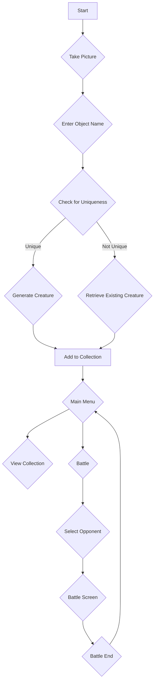

# DESIGN.md

## Overview

This document outlines the design for "CatchAnything," a mobile application that allows users to capture real-world objects by taking pictures, which are then transformed into unique, collectible creatures. Users can then train, evolve, and battle these creatures against others. The app will leverage AI for image recognition, and generative AI for creating creature images and descriptions.

## Detailed Analysis of the Goal or Problem

The goal is to create an engaging game that combines real-world interaction with a fantasy creature-collecting and battling experience. The core problem is to design a system that can:

1.  Take a user-submitted image and identify the object in it.
2.  Generate a unique creature based on the object, including an image and a set of "fair, creative rules" (stats and abilities).
3.  Provide a system for users to manage their collection of creatures.
4.  Implement a battle system for creatures, including real-time PvP and boss battles.
5.  Implement a progression system for creatures (upgrading, evolving, combining).

## Alternatives Considered

### Creature Generation

*   **Pre-defined Creatures:** We could have a pre-defined set of creatures that are linked to certain object categories. This would be simpler to implement but would lack the "unique" and "creative" aspect that generative AI provides.
*   **Purely Generative:** We could generate everything about the creature on the fly. This provides maximum creativity but might lead to unbalanced or nonsensical creatures.

The chosen approach is a hybrid one: the core stats and abilities are determined by a set of rules based on the object's classification, while the visual appearance and flavor text are generated by AI. This provides a good balance between creativity and game balance.

### Data Persistence

*   **Local Storage:** Storing all data on the user's device is the simplest approach but has no backup and doesn't allow for multiplayer features.
*   **Cloud Database:** Using a cloud database (like Firebase Firestore) allows for data persistence across devices and is essential for multiplayer features.

We will use a cloud database to ensure a robust and scalable backend.

## Detailed Design

### Architecture

The app will be built using Flutter and will follow a clean architecture pattern, separating the presentation, domain, and data layers.

*   **Presentation Layer:** This will be the Flutter UI, responsible for displaying the app's screens and handling user input. It will use the BLoC (Business Logic Component) pattern for state management.
*   **Domain Layer:** This layer will contain the core business logic of the game, including the rules for creature generation, battles, and progression. It will be written in pure Dart and will be independent of the UI and data layers.
*   **Data Layer:** This layer will be responsible for all data-related operations, including communicating with the AI services and the cloud database. It will use the Repository pattern to abstract the data sources.

### Diagrams

#### App Flow



#### Architecture

```mermaid
graph TD
    subgraph Presentation Layer
        A[UI (Widgets)]
        B[State Management (BLoC)]
    end
    subgraph Domain Layer
        C[Use Cases / Interactors]
        D[Entities (Creatures, etc.)]
    end
    subgraph Data Layer
        E[Repositories]
        F[Data Sources (API, DB)]
    end

    A --> B;
    B --> C;
    C --> D;
    C --> E;
    E --> F;
```

### Data Models

The core data models will be:

*   **User:** Represents a user of the app.
*   **Creature:** Represents a single creature in the game. This will contain all the stats and abilities as defined in the "Universal Object Game System".
*   **Object:** Represents a real-world object that has been scanned.

### UI/UX Flow

1.  **Onboarding:** A brief tutorial explaining the core concepts of the game.
2.  **Home Screen:** The main hub of the app, with options to:
    *   Capture a new object.
    *   View the creature collection. Shows a preview of your main team.
    *   Start a battle.
    *   View quests and achievements.
3.  **Capture Flow:**
    *   The user is prompted to take a picture of an object.
    *   The user is then asked to provide a 1-2 word name for the object.
    *   Using the name and the image an LLM will determine what the object is and if it already exists in the app
    *   The app shows a loading indicator while the creature is being generated.
    *   A "new creature" screen is displayed, showing the generated creature's image, stats, and abilities.
4.  **Collection Screen:** A grid or list view of all the creatures the user has collected. Tapping on a creature opens a detail screen.
5.  **Battle Screen:** A turn-based battle interface showing the two battling creatures, their health bars, and the available actions.

## Summary of the Design

The "CatchAnything" app will be a Flutter-based mobile game that uses AI to turn real-world objects into collectible creatures. The app will feature a robust game system with stats, abilities, and progression, as well as a real-time PvP battle system. The architecture will be based on clean architecture principles, ensuring a scalable and maintainable codebase.

## References

*   **Flutter:** [https://flutter.dev/](https://flutter.dev/)
*   **Clean Architecture:** [https://blog.cleancoder.com/uncle-bob/2012/08/13/the-clean-architecture.html](https://blog.cleancoder.com/uncle-bob/2012/08/13/the-clean-architecture.html)
*   **BLoC Pattern:** [https://bloclibrary.dev/](https://bloclibrary.dev/)
*   **Firebase Firestore:** [https://firebase.google.com/docs/firestore](https://firebase.google.com/docs/firestore)
